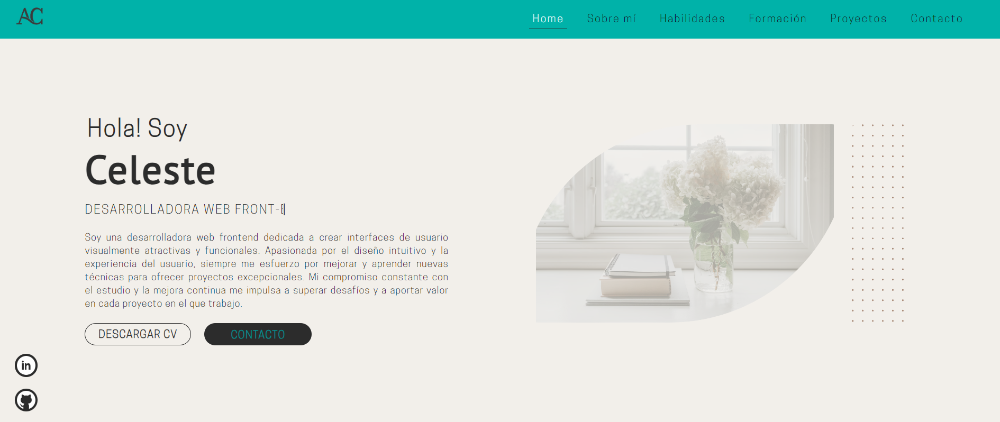

alt

# Portafolio de Ana Celeste Pérez Oviedo

¡Bienvenido/a a mi portafolio! Soy **Ana Celeste Pérez Oviedo**, una desarrolladora web front-end apasionada por crear interfaces de usuario atractivas y funcionales.

## Descripción

Este portafolio es una recopilación de mis habilidades, proyectos, y formación. He utilizado tecnologías modernas para desarrollar este sitio web, centrándome en el diseño intuitivo y la experiencia del usuario.

## Tecnologías Utilizadas

- **HTML5**: Estructuración del contenido web.
- **CSS3**: Estilos y diseño responsivo.
- **JavaScript**: Interactividad y funcionalidad.
- **Formspree**: Implementación del formulario de contacto.
- **Git**: Control de versiones.
- **GitHub**: Hosting del proyecto y repositorio de código.

## Estructura del Proyecto

El proyecto está organizado de la siguiente manera:

- `index.html`: Página principal del portafolio.
- `assets/`: Carpeta que contiene imágenes, hojas de estilo, y scripts.
  - `images/`: Imágenes utilizadas en el sitio.
  - `stylesheet/`: Hojas de estilo CSS divididas para diferentes resoluciones (móvil, tablet, desktop).
  - `js/`: Scripts para interactividad y funcionalidad.
  
## Secciones del Portafolio

- **Home**: Una presentación breve sobre quién soy y qué hago.
- **Sobre mí**: Un resumen de mi trayectoria y mi transición hacia el desarrollo web.
- **Habilidades**: Las tecnologías y herramientas con las que trabajo.
- **Formación**: Mis estudios y cursos relacionados con el desarrollo web.
- **Proyectos**: Una muestra de los proyectos que he desarrollado.
- **Contacto**: Un formulario para que puedas ponerte en contacto conmigo.

## Cómo Ver mi Portafolio

Puedes ver mi portafolio en el siguiente enlace: [Ver Portafolio](https://celeste941.github.io/portafolio-celestePerez)

## Contacto

Si deseas contactarme, puedes hacerlo a través de las siguientes plataformas:

- **LinkedIn**: [Ana Celeste Pérez Oviedo](https://www.linkedin.com/in/ana-celeste-perez-oviedo-29bb0218a/)
- **GitHub**: [Celeste941](https://github.com/Celeste941)

O puedes enviarme un mensaje directamente desde el [formulario de contacto](#contacto) en mi portafolio.

---

Gracias por visitar mi portafolio. ¡Espero que te guste mi trabajo!
